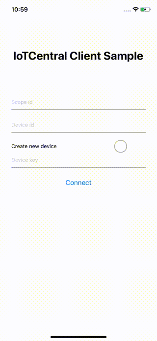

# Azure IoTCentral device client for React Native

This project provides a react-native compatible version of the IoTCentral device client. The client is Promise-based and written in Typescript.

[](https://badge.fury.io/js/react-native-azure-iotcentral-client)

## Getting Started

Install the package and its dependency:
```bash
npm install react-native-azure-iotcentral-client react-native-get-random-values
```
_react-native-get-random-values_ provides a polyfill for random generated numbers. This package is mandatory and needs to be imported in project root (index.js, App,js ...);

<br/>

**App.js**

```js
import 'react-native-get-random-values';
```

### Types
Source code is written in Typescript so types are bundled with the package, you don't need to install any additional package

### Connect

#### Symmetric Key
```js
import {IoTCClient} from 'react-native-azure-iotcentral-client';

const scopeId = 'scopeID';
const deviceId = 'deviceID';
const sasKey = 'masterKey';

const iotc = new iotCentral.IoTCClient(deviceId, scopeId, IOTC_CONNECT.SYMM_KEY,sasKey);

async function main(){
    await iotc.connect();
}

main();
```
It is possible to use both group keys (_SYMM_KEY_) and device keys (_DEVICE_KEY_).
When specifying a device key as _sasKey_ option the connection type must be _IOTC_CONNECT.DEVICE_KEY_

### Operations
After successfull connection, IOTC context is available for further commands.

All the callbacks are optional parameters and are triggered when message has reached the ingestion engine.

### Send telemetry

Send telemetry every 3 seconds
```js
setInterval(async() => {
            await iotc.sendTelemetry({
                field1: value1,
                field2: value2,
                field3: value3
            }, properties)
```
An optional *properties* object can be included in the send methods, to specify additional properties for the message (e.g. timestamp, content-type etc... ).
Properties can be custom or part of the reserved ones (see list [here](https://github.com/Azure/azure-iot-sdk-csharp/blob/master/iothub/device/src/MessageSystemPropertyNames.cs#L36)).

### Send property update
```js
await iotc.sendProperty({fieldName:'fieldValue'});
```
### Listen to property updates

```js
iotc.on(IOTC_EVENTS.Properties, callback);

```
The callback is a function accepting a Property object. Once the new value is applied, the operation must be acknoledged to reflect it on IoTCentral app.

```js
iotc.on(IOTC_EVENTS.Properties, async (property) => {
    console.log('Received '+property.name);
    await property.ack('custom message');
});

```

### Listen to commands
```js
iotc.on(IOTC_EVENTS.Commands, callback);

```
The callback is a function accepting a Command object. To reply, just call the reply function.

```js
iotc.on(IOTC_EVENTS.Commands, async (command) => {
    console.log('Received '+command.name);
    await command.reply(status,'custom message');
});

```
_status_ is of type *IIoTCCommandResponse*
```js
enum IIoTCCommandResponse {
    SUCCESS,
    ERROR
}
```

## One-touch device provisioning and approval
A device can send custom data during provision process: if a device is aware of its IoT Central template Id, then it can be automatically provisioned.

### How to set IoTC template ID in your device
Template Id can be found in the device explorer page of IoTCentral


Then call this method before connect():

```
iotc.setModelId('<modelId>');
```

### Manual approval (default)
By default device auto-approval in IoT Central is disabled, which means that administrator needs to approve the device registration to complete the provisioning process.
This can be done from explorer page after selecting the device


### Automatic approval
To change default behavior, administrator can enable device auto-approval from Device Connection page under the Administration section.
With automatic approval a device can be provisioned without any manual action and can start sending/receiving data after status changes to "Provisioned"


## Sample
The _sample_ folder contains a sample React Native mobile application to play with the library.

<p align='center'>

</p>

## Instructions

```bash
cd ./sample

npm install

# for iOS only
cd ./ios && pod install && cd ..

npm run ios # or 'npm run android'
```

This sample does not use published npm package but compiled code in the parent folder. In this way you can tweak library code and easily test it through the mobile app.
Every time library code changes, you need to re-build and re-install package in the mobile app.

```bash
npm run build

cd ./sample

npm install
```